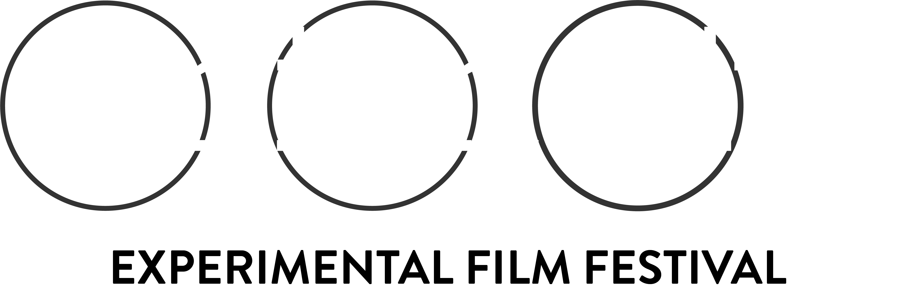
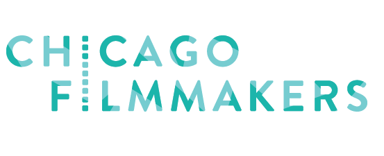
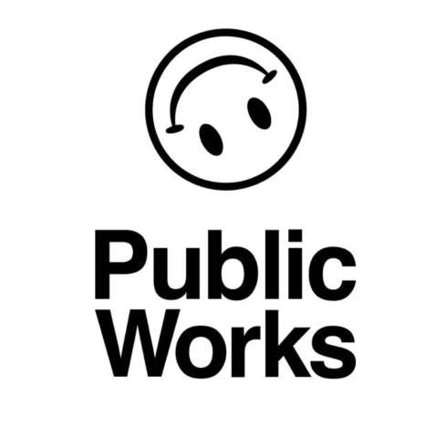

import LinkButton from '@components/LinkButton.astro';

# Overview

Onion City Film Festival and the Center for Concrete and Abstract Machines (CCAM) co-present a live performance program adjacent to the festival exploring “expanded cinema” in an attempt to put cinematic art to the tasks of resistance, rupture, and reconfiguration of mediatic experience. We ask: how can experimental modes of animating sound and moving image reconfigure the possibility of our relating to one another anew?

# Program

## Performances

### Ruby Que // How Far the Moon

### Alan Perry // Ritual Unbinding of Alexa

### Hunter Whitaker-Morrow // The Emissary

### Liyan Zhao and Liam O'Brien // The Question of Grief

## Installations

### Kristin McWharter // Wave

### Andrew Wood // Seventy Five Threads

### Luciana Decker // Language of Entrails

# Tickets

Tickets are $15.

Tickets must be bought through the Onion City website. Because of zoning restrictions, guests without tickets at the door will be referred to buy tickets through the website.

<LinkButton
    text="BUY TICKETS HERE"
    url="https://chicagofilmmakers.org/upcoming-screenings-and-events/ocffwedontknow"
/>

# Partners

