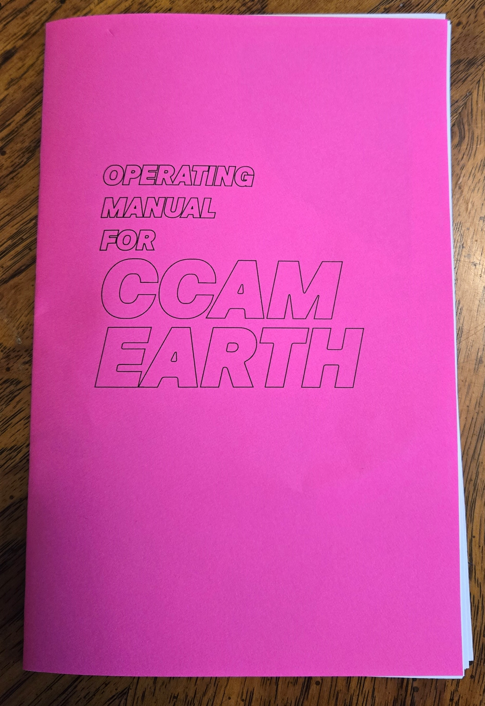

import { YouTube } from 'astro-embed';

Thanks to drum machines, sound systems, repurposed warehouses and basements, 1980s Chicago House Music opened up a future that was black, brown and queer. DJs invented new ways of keeping and marking time in community. In the years since, computation has made music-making more accessible. What kinds of collectivities are still to come?

Combining complementary modes of thinking, making, and performing, Futurhythmachines: House (FRM:House) is a daylong public event organized during the BADS_lab, featuring a DIY synthesizer workshop, a panel discussion, and a DIY synth performance + reception.

FRM:House will reflect on social forms, expressive technics, and musical experience through Chicago House Music, discovering therein an art of forming fugitive publics and a science of probing sonic ecologies.

## Timetable

|       |                                                                     |
| ----- | ------------------------------------------------------------------- |
| 12:00 | DIY Synth Workshop                                                  |
| 4:00  | Panel Discussion w. Thomas DeFrantz, Meida McNeal, and Duane Powell |
| 6:00  | Reception w DJ girly\*\*\*                                          |

## DIY Synth Workshop

Participants will receive one of three small synthesizers we designed as a set of Chicago house music machines. In the workshop, we will focus on musical interactions _between_ modules. This means that with a friend, you can team up to create a more robust musical landscape.

Although we'll provide some starter software for CCAM EARTH, it is built around a microcontroller called Daisy Seed. This means it's reprogrammable and in the future you can upload code written in a number of different languages, including Max/MSP Gen~, Arduino and more. We hope to build community around the sharing of software for this platform.

Spots are limited to 15, and a registration of $25 dollars will hold you spot (subsidized generously by our sponsors below).

<LinkButton text="Register Here" url="https://ko-fi.com/s/bda17c5c40" />

We have 5 sponsored spots for black folks and people of color; please reach out directly if that is of interest to you [hello@ccam.world](mailto:hello@ccam.world?subject=FRMChicagoHouse).

<YouTube id="https://www.youtube.com/watch?v=9Ru7y606L2Q" />

We created a zine documenting the hardware and software. Click below to [download](/assets/pdf/2024-05-10-CCAM-EARTH-ZINE.pdf).

## Panel

BADS_lab organizer Muindi Fanuel Muindi (philosopher & poet) will moderate a panel with Dr. Thomas DeFrantz (black social dance historian & technology theorist), DJ Duane Powell (House DJ & music historian), and Meida McNeal (multi-disciplinary performance artist & critical ethnographer) to discuss the sonic and social architectures of Chicago House and their surrounds. The panel discussion will situate Chicago House within a long lineage of antiphonal experiments in the Black Arts that have gathered people in movement and in apposition to prevailing paradigms of capture, control, and containment.

Following the workshop and panel discussion, organizers at CCAM and the Fyrthyr invite the public to join them for bites, refreshments, music, and critical conversations inspired by the day's proceedings. You are also invited to learn more about the projects and missions of CCAM and the Fyrthyr and to get involved.

Reception DJ is girly\*\*\*, a BADSlab fellow.

## Publication

This event will seed our first FRM publication, which will include a transcription of the panel, DIY synth instructions, and writings on Chicago House Music’s legacy in black music, technology, and sociality by invited authors to be published in December 2024.

## Support

This program is supported by Hyde Park Art Center’s Artists Run Chicago Fund in partnership with Art Design Chicago, a citywide collaboration initiated by the Terra Foundation for American Art that highlights the city’s artistic heritage and creative communities.

FRM: Chicago House is also supported by Watershed Art & Ecology and Electro-Smith.
