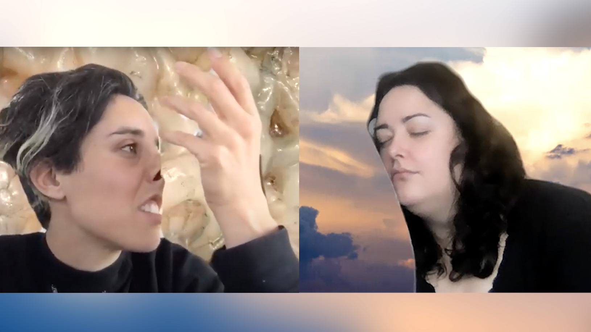

import LinkButton from '@components/LinkButton.astro';
import { Vimeo } from '@astro-community/astro-embed-vimeo';

## Registration

Please note, spots are limited.

<LinkButton text="REGISTER HERE" url="https://forms.gle/JNt32R64HC97aDwr7" />

## About the Artists

Selwa Sweidan & Nina Sarnelle are artists based on Tongva/Kizh land often referred to as Los
Angeles. Our independent practices have circulated around touch and haptics for a long time.
We began working together on this collaborative touch praxis at the beginning of the
pandemic in Spring 2020. Together we’ve developed a research methodology consisting of
workshops, prompts, interviews, reading, discussion and collaborative writing.

## What is Touch?

in a time of high stakes touching—of elbow-bumps,
contactless delivery and lethal choke-holds? Tactile
experience is critical to our understanding of bodies in
space, as well as to the construction of social life and how we
interact with the world.

Do flowers feel? Do lobsters feel? Do bacteria feel? Does gravel feel? The way that we answer these questions
profoundly determines modes of relating through touch, shaping culture, politics, spirituality, ethics and law.

In all its capacity for healing and care, touch is tightly bound to vulnerability, and perhaps for this reason, holds equal
potential for subjugation and harm. In many contexts, touch and touch-deprivation are wielded by systems of domination
and violence (Haney 2021; Tuggle 2021; Spillers 2018). Hortense Spillers has described non-consensual touch under slavery
as the “single most powerful evidence of the loss of freedom,” generating trauma which cannot be reduced to physical
injury alone. When is touch ‘worth the risk’, and for whom?

## What is Touch Praxis?

-   Touch as a creative, time-based medium
-   A way of working with others, where ‘every body’ is engaged
    in the making/knowing
-   Integrates ideas from queer theory, racial and disability
    justice, quantum physics, critical technology, and
    somaesthetic ecology
-   A method for feeling one’s way through complex issues
    related to access, inclusion, consent, power, entanglement,
    alterity, and techno-subjectivity.

## Related Media

<Vimeo id="545218043" />
