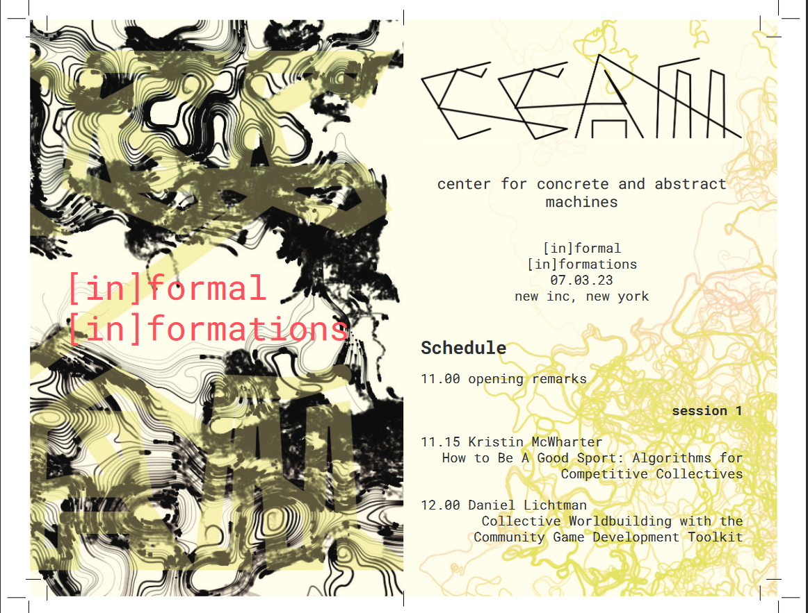

### Attendees

#### Presenters

-   Muindi Fanuel Muindi (philosophy, performance)
-   Garrett Laroy Johnson (media arts and sciences)
-   Daniel Lichtman (media art)
-   Kristin McWharter (game and media art)
-   Asa Sakrison (cultural geography, process theory)
-   Lee Tusman (media art)

#### Respondents

-   Maria Fernanda (philosophy)
-   Meg Hartwig (sculpture)
-   Dakota Gearhart (media art)
-   Man Kaplan (sociology and women's/gender studies)
-   Sam Stoelje (literature and the occult)
-   Phillip Thurtle (philosophy of science and technology)
-   Çaca Yvair (conservation and geoecology)

### Abstract

informal (in)formations seeks to gather perspectives and insights
into the state of practitioner or member run organizations for speculative,
critical, or restorative art-research. In her manifesto “Another Science is
Possible”, Isabelle Stengers calls for research and practice to reorganize
itself around the concerns of the public.

This symposium asks: what matters of concern are cresting in 2023, and what can been see on the horizon, can be heard
in bars and at bus stops? What are artists and researchers obligations to the
public? Which public? What does the term “public” do that “community” does not?
What does it even mean to listen? How can artist-run spaces and collectives,
community organizing, collaborative software and publishing projects respond to
a public without falling into neoliberal traps of “participatory design”?

In the US American funding economy, there is scarce funding for doing arts-research,
research-creation, or art-led research. As a result ‘interdisciplinarity’
remains a vapid buzzword in the art world which is largely repulsed by the
hybridization of practices. On the academic end, art practice is carelessly (or
violently) assimilated into the industry of science, technology, and empire.
Instead of fantasizing about European funding spigots, which also run dry, this
symposium asks: what is possible for arts-research in our unique US American
geopolitical, socioeconomic, racial, mediatized context?

What work can be done by an informality of group formation work that formality cannot? What techniques
enable the assemblage of research and practice beyond disciplinary enclosure?
How do we guarantee that such an “ecology of practices”, to borrow again from
Stengers, bears an ethos sufficient the public it imbricates? In this small and
informal symposium, we gather a diversity of perspectives that aspire to see the
challenges and problematics of art and research organizing in a new light.

## Thanks

Special thanks to NEW INC and Dakota Gearhart!
