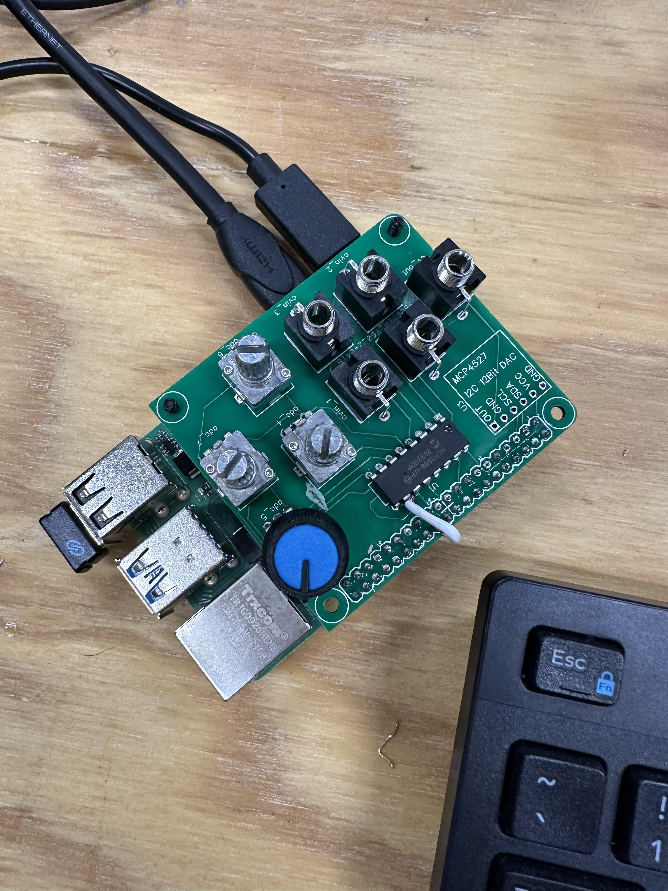
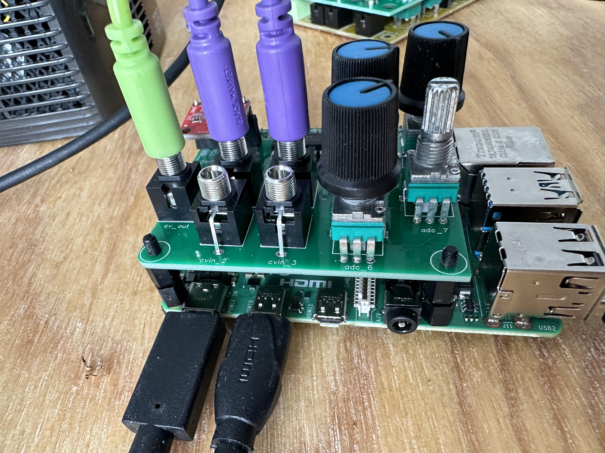
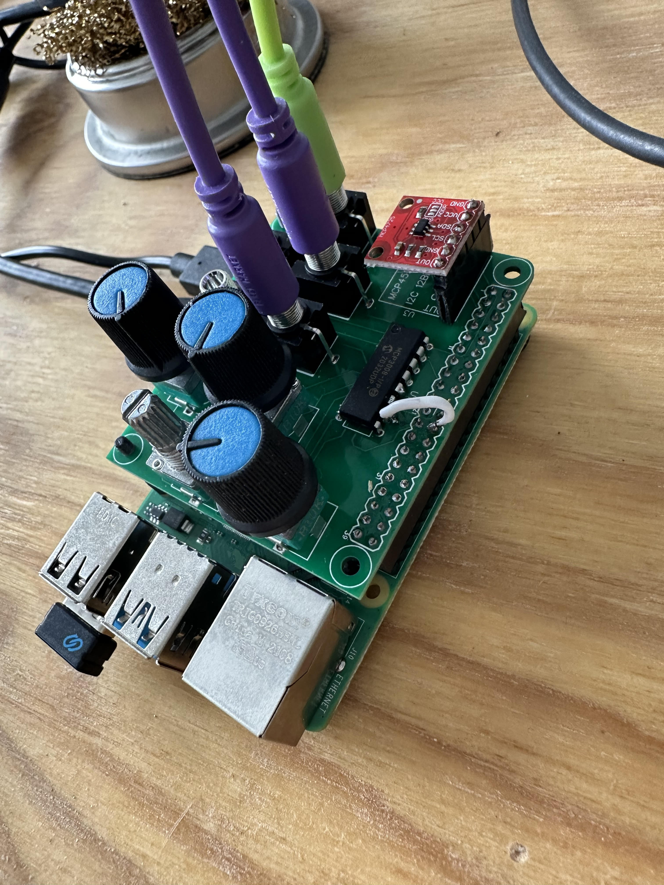

import { YouTube } from '@astro-community/astro-embed-youtube';

## Processing Pi Video Synth

This page documents an internal CCAM R&D project. Loading Processing 4 onto a Raspberry Pi Pro, we intend to make a video synth which is interoperable with 3v3 modular synthesis hardware via control voltage. Using an MCP3008 chip we are able to create 8 ADC channels (or CV ins). Via a MCP 4725 breakout, we equip a 12-bit DAC, or 1-channel cv out.

Below, a crude "proof of concept" video, showing the custom Pi Hat prototype functioning. Processing is receiving analog signals via the MCP3008 IC as interpreted by the Hardware I/O library.

<YouTube id="W1dB7Z5PwaM" />
