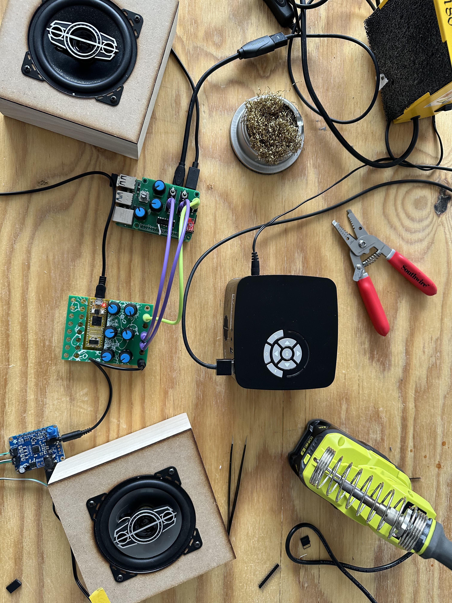

## Processing Pi Video Synth

This page documents an internal CCAM R&D project. Loading Processing 4 onto a Raspberry Pi Pro, we intend to make a video synth which is interoperable with 3v3 modular synthesis hardware via control voltage. Using an MCP3008 chip we are able to create 8 ADC channels (or CV ins). Via a MCP 4725 breakout, we equip a 12-bit DAC, or 1-channel cv out.

